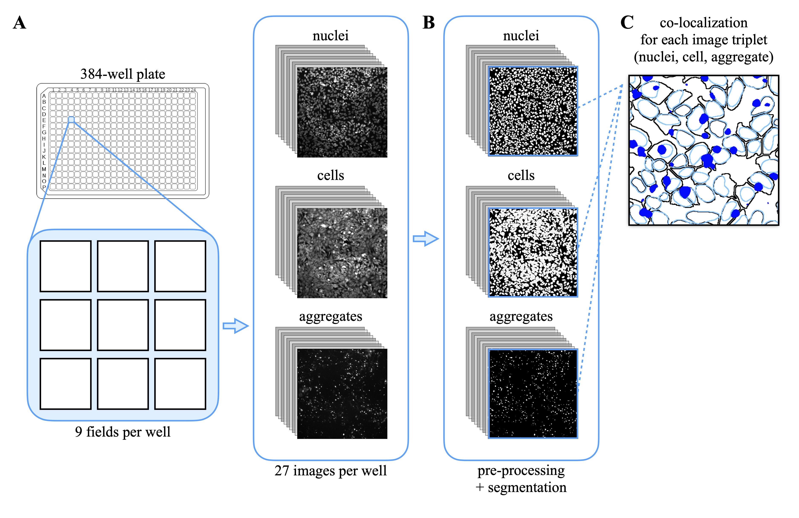
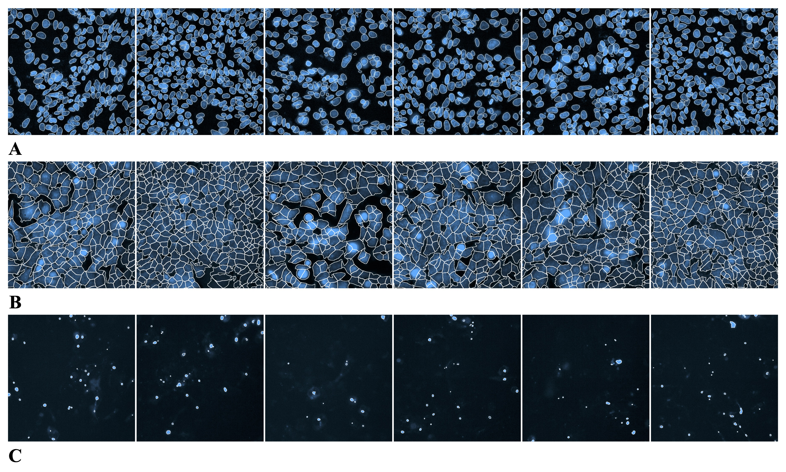
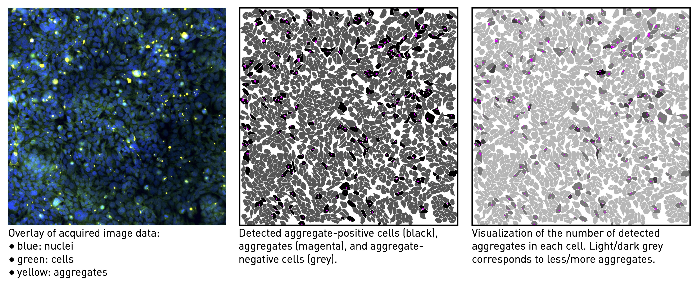

# AggreQuant

Automated aggregate quantification for High Content Screening (HCS) image analysis.

## Overview

AggreQuant is a Python package for automated analysis of High Content Screens, specifically designed for quantifying α-synuclein protein aggregates in live-cell fluorescence microscopy data.

The input image data are assumed to be generated from HCS plates (96 or 384 wells), with multiple fields of view per well and 3 channels per field:
- **Nuclei** (Blue, 390nm)
- **Cells** (FarRed, 640nm)
- **Aggregates** (Green, 473nm)

For a 384-well plate with 9 fields per well, 10,368 images are processed to quantify aggregate-positive cells.



## Features

- **Nuclei Segmentation**: StarDist pre-trained deep neural network
- **Cell Segmentation**: Cellpose or distance-intensity algorithm
- **Aggregate Segmentation**:
  - Filter-based method (calibrated image processing filters)
  - Neural network method (PyTorch UNet with modular architecture)
- **Focus Quality Assessment**: Blur detection to exclude out-of-focus regions
- **Colocalization Analysis**: Characterize aggregate inclusions in cells
- **Export**: Statistics in Parquet, CSV, or Excel format



## Installation

### Conda Environment

```bash
# Create and activate environment
conda create -n AggreQuant python=3.11
conda activate AggreQuant

# Install core dependencies
pip install numpy scikit-image opencv-python-headless tifffile pandas pyarrow pyyaml pydantic click tqdm matplotlib

# Install the package in development mode
pip install -e .
```

### Optional Dependencies

```bash
# For running the segmentation pipeline (StarDist, Cellpose)
pip install torch torchvision stardist cellpose

# For training neural networks
pip install torch torchvision albumentations segmentation-models-pytorch tensorboard

# For the GUI
pip install customtkinter
```

## Usage

### Quick Start

1. Adjust parameters in `applications/setup.yml`
2. Run analysis:
```bash
python main.py
```

### As a Package

```python
from aggrequant.quality import compute_focus_metrics, generate_blur_mask
from aggrequant.loaders import PipelineConfig, Plate, ImageLoader
from aggrequant.common import normalize_image

# Load and assess image quality
loader = ImageLoader(
    directory="path/to/images",
    channel_patterns={"DAPI": "C01", "GFP": "C02", "CellMask": "C03"}
)

# Compute focus metrics
metrics = compute_focus_metrics(image, patch_size=(40, 40), blur_threshold=15)
if metrics.is_likely_blurry:
    print(f"Image is likely blurry: {metrics.pct_patches_blurry:.1f}% patches below threshold")
```

## Project Structure

```
AggreQuant/
├── aggrequant/              # Main package
│   ├── common/              # Shared utilities (image_utils, logging)
│   ├── loaders/             # Data loading (config, images, plate)
│   ├── quality/             # Image quality (focus/blur detection)
│   ├── segmentation/        # Segmentation backends
│   │   ├── nuclei/          # StarDist wrapper
│   │   ├── cells/           # Cellpose, distance-intensity
│   │   └── aggregates/      # Filter-based, neural network
│   ├── quantification/      # QoI calculations
│   ├── statistics/          # Well stats, export
│   └── nn/                  # Neural network development
│       ├── architectures/   # Modular UNet with pluggable blocks
│       ├── data/            # Dataset, augmentation
│       ├── training/        # Losses, trainer
│       └── evaluation/      # Metrics, benchmarking
├── gui/                     # GUI application
├── scripts/                 # Development scripts
├── tests/                   # Unit and integration tests
├── PROJECT.md               # Detailed project documentation
└── pyproject.toml           # Package configuration
```

## Quantities of Interest (QoI)

AggreQuant computes various metrics including:
- Percentage of aggregate-positive cells
- Number of aggregates per cell
- Total aggregate area over cell area
- Focus quality metrics (variance of Laplacian, etc.)



## Development

See [PROJECT.md](PROJECT.md) for detailed development documentation including:
- Architecture design decisions
- Implementation phases and task lists
- Code style guidelines
- Literature review of UNet architectures

### Running Tests

```bash
conda activate AggreQuant
pytest tests/
```

## Author

**Athena Economides, PhD**  
Prof. Adriano Aguzzi Lab  
Institute of Neuropathology  
University of Zurich & University Hospital Zurich  
Schmelzbergstrasse 12  
CH-8091 Zurich  
Switzerland  

Contact: [athena.economides@uzh.ch](mailto:athena.economides@uzh.ch)

## License

This project is under development. Please contact the author for usage permissions.
